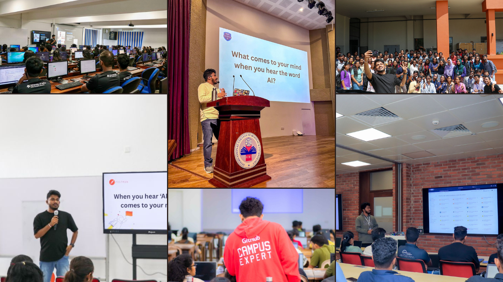

<h1 align="center">Hey 👋, I'm Nisal Gunawardhana</h1>
<h3 align="center">Software Engineer | Tech Speaker | Microsoft Learn Student Ambassador | Postman Student Leader |GCE 🚩</h3>

  
  
  

  

I'm a **Software Engineer** and **Tech Speaker** specializing in artificial intelligence, cloud technologies, and modern web development. My journey in technology is driven by a passion for innovation and a commitment to empowering the next generation of developers.

As a **Microsoft Learn Student Ambassador**, **Postman Student Leader**, and **GitHub Campus Expert**, I bridge the gap between cutting-edge technology and aspiring developers. My expertise spans across **AI/ML integration**, **Microsoft Azure**, and full-stack development, with particular focus on the **Model Context Protocol (MCP)** and cloud-native architectures. I work extensively with **nodejs** ,**Nestjs**,**Laravel**, **Spring Boot**, **.NET**, **React**, and **Flutter(as mobile developer)** to build scalable, enterprise-grade solutions.

My professional endeavors include building AI-powered applications, architecting cloud solutions on **Azure**, and developing cross-platform mobile experiences.As the Founder of **apestore.lk**, I’m building an **organic farming network and organic food store**, connecting farmers and consumers through a trusted, sustainable ecosystem.Through **Asyntax**, I transform ideas into **scalable digital solutions**, helping businesses innovate and grow with modern technology.I also maintain an active presence as a **LinkedIn Top Voice**, where I share insights on **technology trends, digital transformation, and career development**, supporting professionals in navigating the evolving tech landscape.

Through speaking engagements at conferences and tech meetups, I inspire developers to embrace modern technologies and API-first development practices. I'm committed to delivering innovative solutions that drive technological advancement.

<table>
<tr>
<td align="center" width="25%">
<h4>💡 Mentorship</h4>

Guiding developers in AI, cloud technologies, and modern web development

</td>
<td align="center" width="25%">
<h4>🎤 Speaking</h4>

Available for tech conferences, workshops, and community events

</td>
<td align="center" width="25%">
<h4>🔧 Consulting</h4>

Expertise in Microsoft technologies, API development, and cloud solutions

</td>
<td align="center" width="25%">
<h4>📚 Content Creation</h4>

I create technical writing and educational content on YouTube, LinkedIn, and my blog.

</td>
</tr>
</table>

<h3 align="center">💬 "Empowering the next generation of developers through technology, mentorship, and innovation"</h3>

<strong>Open to collaborations • Speaking opportunities • Mentorship</strong>

